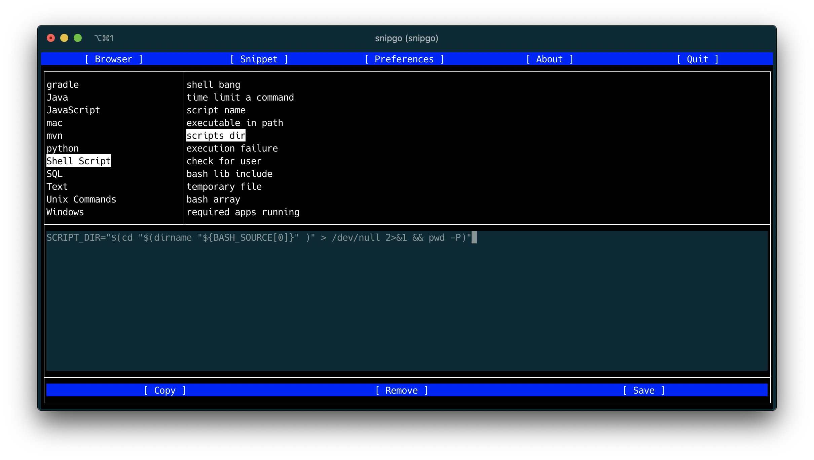

------
# SnipGo

Playing around with a Go and curses based program to manage my snippets. A terminal version, in Go of my KSnip project.

## What's Here
This project is for learning in Go:

 - Terminal based UI: github.com/rivo/tview
 - Unit testing: github.com/stretchr/testify
 - Mocking (github.com/golang/mock) vs Monkey Patching (github/bouk/monkey)
 - Dependency injection patterns
 - Github Actions for Go: actions/setup-go@v2
